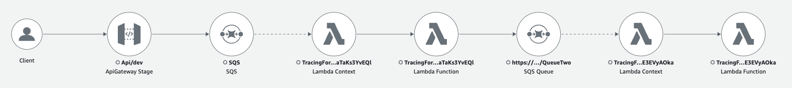

# About the Demo
The Demo deploys a distributed serverless application, that is instrumented with AWS X-Ray.
The front door of the application is an Amazon API Gateway that receives Events and stores them in an Amazon SQS Queue.
A dummy Serverless Function reads from the Queue, processes the event and stores the processed event in a second Queue for another Service.



## How to run the demo

### Deploy the CDK App
- `cdk bootstrap`
- `cdk deploy`

### Send message
Send some messages to the API Gateway Endpoint and review the traces in the CloudWatch Console

```
curl --header "Content-Type: application/json" \
  --request POST \
  --data '{"message":"Hello World"}' \
  https://{YOUR_API_GATEWAY_ENDPOINT}/dev/
```

